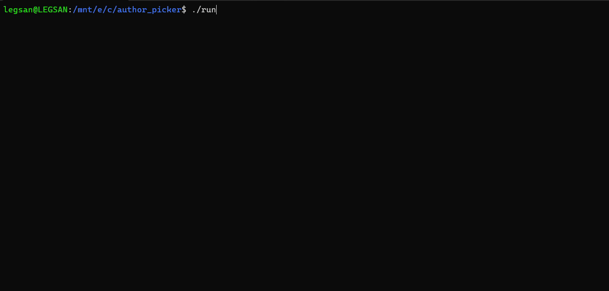

#  Author-Picker

Keep track of authors or albums to listen to and then, whenever you feel like it, extract a new author/album as a suggestion for your next music session!

## Table of Contents

- [Installation](#installation)
- [Usage](#usage)
- [Contributing](#contributing)

## Installation

> WARNING! C compiler is needed to install this software.

> This software was not tested on Mac or Windows (only on wsl).

### Ubuntu (or WSL)

1. Clone this repository: `git clone https://github.com/Gab-San/Author-Picker.git`
2. Get into the folder: `cd author_picker/`
3. Compile the program: the makefile in the project will compile everything that is needed, just run `make` in the console;
4. Run the program:
    1. Enter into the output folder: `cd out/`
    2. Run the program `./out`

#### Runnable bash file

To facilitate step 4 I wrote a little bash program that will automatically run the program.
Copy paste the following code in a `<file_name>.sh` file:

```bash
#! bin/bash
cd out/
./out
cd ..
```

Open the console and run `chmod u+x <file_name>.sh`; then you can simply run `./<file_name>.sh`

## Usage

To run:

1. Enter the folder `out/` with `cd out/`;
2. Run the program by typing `./out`.

or if you wrote the [runnable bash file](#runnable-bash-file) simply run `./'file_name'.sh`

> Disclaimer! Most of the inputs can be deduced from the menus. The character(s) in between square brackets show what should be the input.

On the first start-up, the first screen that will appear will lets you choose how much time you want to wait before the next extraction command will be accepted:



After which the menu appears, check out the [user manual](./other/user_manual.md) to understand what the actions do. A list of the available commands is displayed below here👇

| Action | Description |
|:------:| ----------- |
| `insert` | insert a new author into the database |
| `extract` | extract an author from the database and set expiration date |
| `view` | print to screen the inserted authors or the extracted one |
| `remove` | remove author from the database |
| `find` | search for an author in the database |

Check [what's next](#whats-next) for more info about coming patches.

## Contributing

This repository is completely open to contribution, but I might not be available to support you, due to exams.

1. Fork the repository.
2. Create a new branch: `git checkout -b feature-name`.
3. Make your changes.
4. Push your branch: `git push origin feature-name`.
5. Create a pull request.

## What's Next

My intentions are not to develop further this software with new functionalities myself. I consider this program finished and working like I intended it to.

Features that could be added are:

- changing the config file in order to have more flexible limits;
- extending expiration time;
- extending language support;

---

Since I'm proud of my little work:
<p align="center">  </p>

Be sure to check the [wiki](https://github.com/Gab-San/Author-Picker/wiki)!
