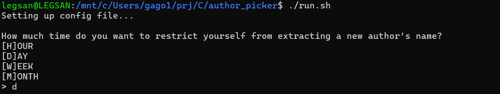
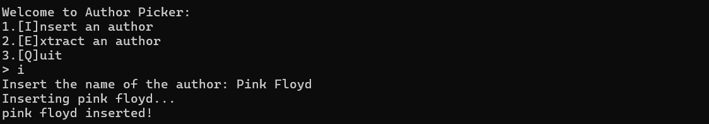
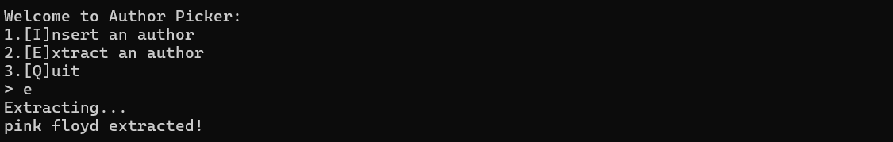
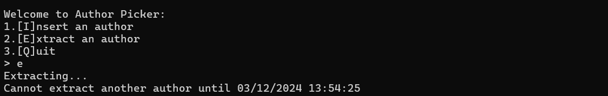

# Author-Picker [PROJECT ON HOLD]
This simple program lets you write down authors or albums you want to listen to and then, whenever you feel like it, you can extract a new author as a suggestion for your next music session!

# Table of Contents
- [Installation](#installation)
- [Usage](#usage)
- [Contributing](#contributing)

# Installation

> WARNING!: C compiler is needed to install this software.

> This software was not tested on Mac or Windows (only on wsl).

## Ubuntu (or WSL)
1. Clone this repository: `git clone https://github.com/Gab-San/Author-Picker.git`
2. Get into the folder: `cd author_picker/`
3. Compile the program:
    - Automatically: the makefile in the project will compile everything that is needed, just write the command `make` 
    - Manually: 
        1. You will need to compile the libraries first:
            - Make a library folder named *lib* (`mkdir lib/`)
            - `gcc -c -g -o lib/helper_lib src/helper_lib.c`
            - `gcc -c -g -o lib/author_picker_lib src/author_picker.c`;
            - `gcc -c -g -o lib/ap_time_lib src/ap_time.c`
        2. Then you can compile and link the main:
            - Make an output folder named *out* (`mkdir out/`)
            -`gcc -g -o out/out src/main.c lib/author_picker_lib lib/helper_lib lib/ap_time_lib`
4. Run the program: `./out/out`

### Runnable bash file
> To facilitate step 3 I wrote a little bash program that will automatically run the program.
Copy paste the following code in a file_name.sh file:
```bash
#! bin/bash
./out/out
```
Then you can simply run `./file_name.sh`

# Usage

To run use  `./out/out` or if you wrote the [runnable bash file](#runnable-bash-file) simply run `./file_name.sh`

On the first start-up, the first screen that will appear will lets you choose how much time you want to wait before the next extraction command will be accepted:



After which the menu appears, right now there are only a couple actions that you can do. (Check [what's next](#whats-next) for more info)

The current available actions are *insert*:



that lets you insert an author name;\
And *extract*:



that lets you extract an author.

If you request another extraction before the time limit has expired then your request will be denied:




# Contributing

Still reading the [guidelines](https://docs.github.com/en/communities/setting-up-your-project-for-healthy-contributions/setting-guidelines-for-repository-contributors).

# What's Next

My intentions are not to develop further this software with new functionalities. I consider this program finished and working like I intended it to.

I will try to add some other actions like:
- checking the catalog;
- changing the config file in order to have more flexible limits;
- make the programs prints and outputs be more verbose;

-----
Be sure to check the [wiki](https://github.com/Gab-San/Author-Picker/wiki)!