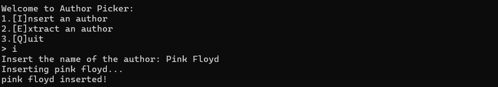
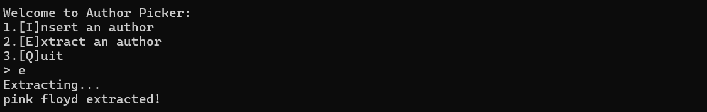
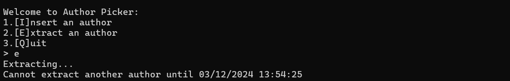
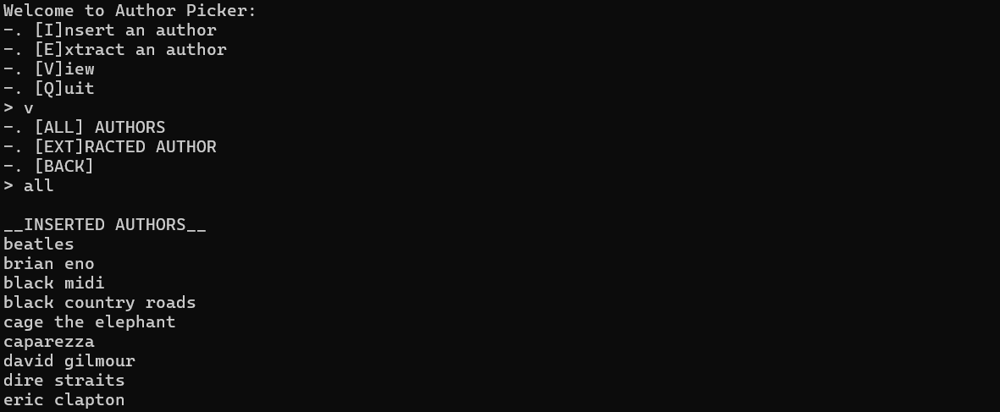
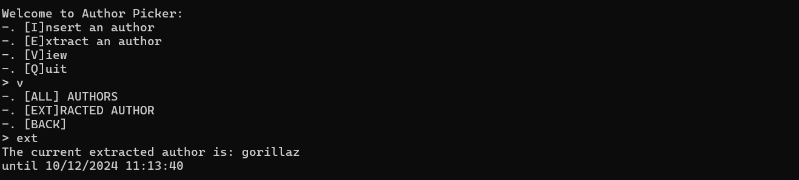
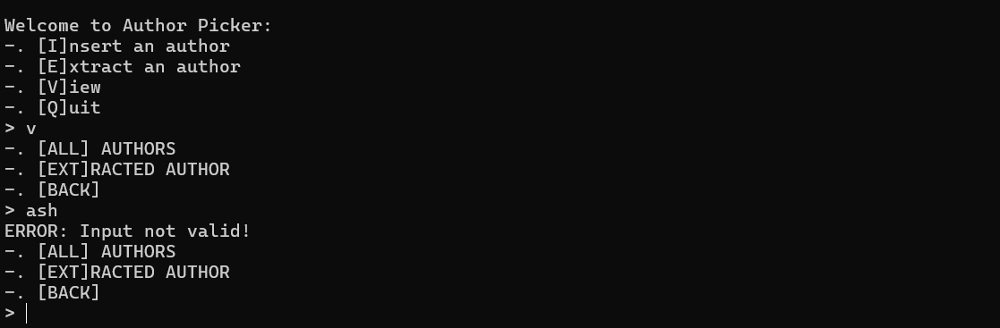
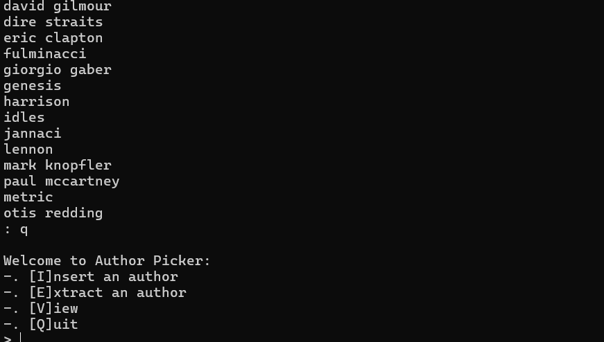

# USER MANUAL

- [Insert](#insert)
- [Extract](#extract)
- [Remove](#remove)
- [Find](#find)
- [View](#view)

## Insert

*Insert* lets you insert an author into the database:

## Extract

*Extract* lets you extract an author and set an expiration date to wait for your next extraction:

If you request another extraction before the time limit has expired then your request will be denied:

## View

You can view the extracted author or the other inserted ones by using the *view* command:

If the input command is incorrect the following screen will be shown:

When in *view all*, in order to stop scrolling authors input `q` when the input appears:

## Remove

You can remove an author, if already present in the database, by using the *remove* action.

## Find

Search for an author in the database by using the *find* command.

A message will be displayed with the result of the action.
>>>>>>> 749e2b7 (Added documentation)
