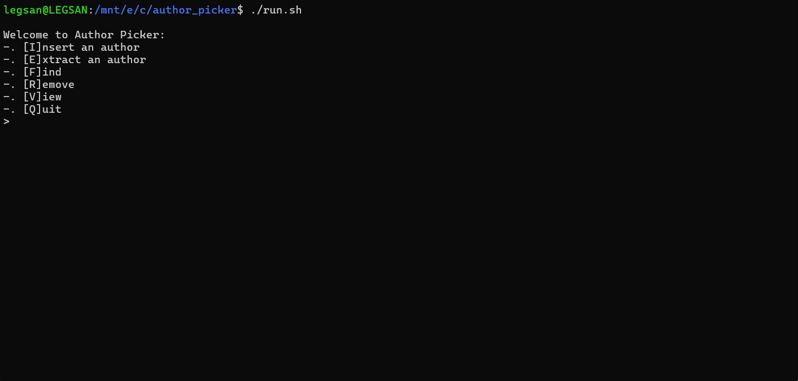
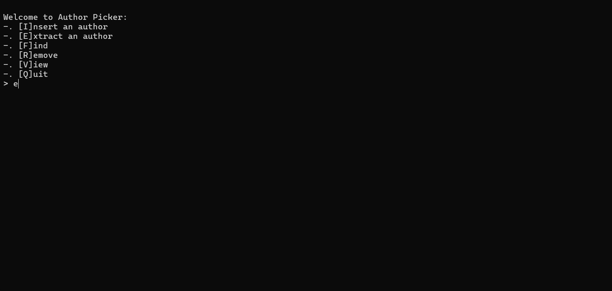
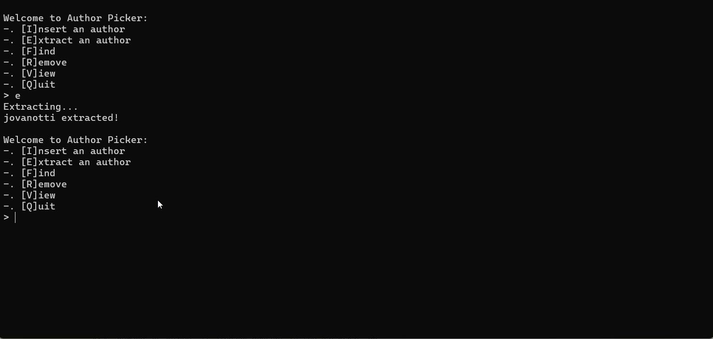
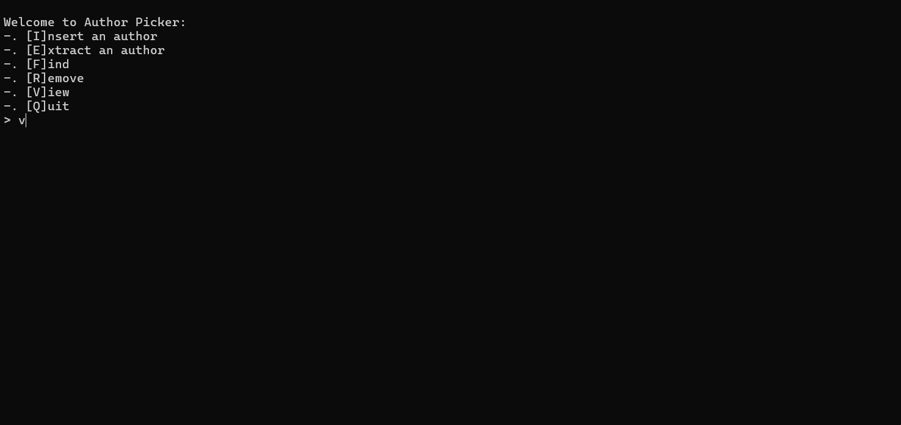
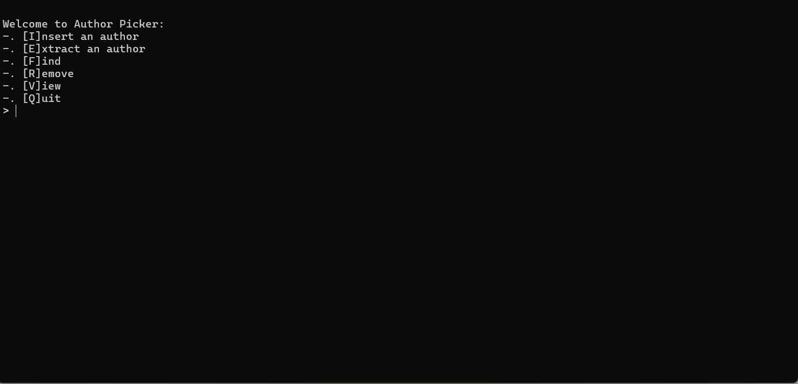

# USER MANUAL

Here the list of actions shown on the menu:

- [Insert](#insert)
- [Extract](#extract)
- [Remove](#remove)
- [Find](#find)
- [View](#view)

## Insert

*Insert* an author into the database:

## Extract

*Extract* an author and set an expiration date. The next extraction will be available only after the date has expired:

If you request another extraction before the time limit has expired then your request will be denied:

## View

View the extracted author or the other inserted ones by using the *view* command:

When in *view all*, in order to stop scrolling authors input `q` when the input appears:

## Remove

Remove an author, if already present in the database, by using the *remove* action:

## Find

Search for an author in the database by using the *find* command; a message will be displayed with the result of the action:

